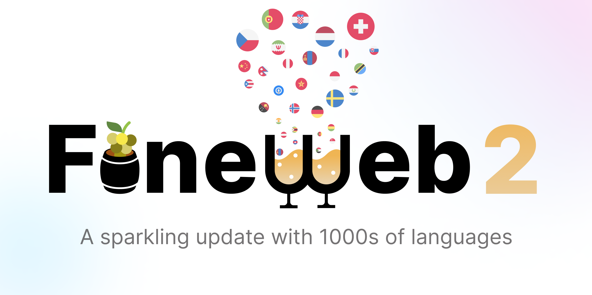

# FineWeb 2

FineWeb 2 is the second iteration of the popular 🍷 FineWeb dataset, bringing high quality pretraining data to over 1000 🗣️ languages.

## Data Pipeline 🚀
The processing pipeline had to be heavily adapted for a multilingual setting. As each language has its own peculiarities, we **individually tuned each filter**, defining different thresholds and stopwords for each language. 📊
These thresholds and stopwords are available in `/configs/{iso3_lang}_{script}.yml`.

The starting point for our dataset was the non-English data (< 0.65 score in English) we obtained when processing the original FineWeb. 🌐
To this data, we applied the following processing steps:
1. Additional Language Identification and filtering 🔍
2. Deduplication per language 🔄
3. Filtering per language 🧹
4. PII Anonymization and fixes 🎭

### Language Identification 🌍
Performed using [GlotLID](https://github.com/cisnlp/GlotLID), which not only covers a wider variety of languages (2000+ available labels) compared to fasttext176 (used in the original FineWeb), as it also identifies the script used in each document. 📜
For each language, we defined *different minimum language classifier confidence scores* to keep a document.

### Deduplication 🗃️
Unlike in FineWeb, where data was deduplicated per CommonCrawl snapshot, in FineWeb 2, **data is deduplicated per language globally**. However, following our deduplication findings in the original FineWeb, while we remove all except one document from each duplicate cluster, we save the size of this cluster in the kept document's metadata, saved in `minhash_cluster_size`.
This allows us to "re-hydrate" the dataset: by upsampling documents based on their cluster size, we see clear performance improvements for some languages, particularly high resource ones. 📈

We did not extensively explore different upsampling weights, but observed promising results with the following weights:
- documents with no duplicates: 1 time
- documents from a cluster of size N=2 or N=3: document will be N times in the final dataset
- documents from a cluster of size N=4: document will be 3 times in the final dataset
- documents from a cluster of size N>=5 and N<100: document will be 5 times in the final dataset
- documents from a cluster of size N>=100: document will be 8 times in the final dataset
- documents from a cluster of size N>=1000: document will be 1 time in the final dataset (the assumption here is that very large clusters are lower quality)

Example "re-hydration" block:
```python
class Rehydrater(PipelineStep):
    def run(self, data: DocumentsPipeline, rank: int = 0, world_size: int = 1) -> DocumentsPipeline:
        import bisect
        upsampling_weights = {1: 1, 2: 2, 3: 3, 5: 5, 100: 8, 1000: 1}
        # Sorted keys
        limits = sorted(upsampling_weights.keys())

        for doc in data:
            upsampling_weight = upsampling_weights[
                limits[bisect.bisect_right(limits, doc.metadata["minhash_cluster_size"]) - 1]]
            # repeat each document upsampling_weight times
            for _ in range(upsampling_weight):
                yield doc
```

### Data Filtering 🧹
We mostly keep the original FineWeb set of filters, and do not create new filters targeting individual languages. As such, we had to extensively ablate on different processes of adapting the English filters to all the languages we supported. 🔍
Based on the results of our experiments, we also disabled/changed global values of some specific filters:
  - For FineWeb filters, we removed `short_line_thr` and changed `char_dup_ratio` from 0.01 to 0.1.
  - Repetition filter: disabled paragraph related filters as trafilatura does not keep them ❌
  - C4 filters: we did not include the C4 filters as they seemed to degrade performance in this multilingual setting 📉

### PII Anonymization and fixes 🎭
- PII Removal: Kept unchanged, emails and ip addresses are anonymized. ✉️
- We applied FTFY to fix encoding issues. 🔧
- Added some code to fix trafilatura created artifacts related to tables 🛠️

## Ablations code 🧪
Each design choice in the pipeline was carefully tested on our created evaluation suite [FineTasks](https://huggingface.co/spaces/HuggingFaceFW/blogpost-fine-tasks). After each pipeline step, we trained a 1.46B model for each language using a nanotron framework and then evaluated one of the tasks. For full transparency we provide both evaluation and training code. 📊

### [Evaluation code](ablations/evaluation) 📝
- `launch_evals.py` is the main scripts used to run evaluations for one specific model.
- `launch_random_evals.py` is a script used to asses a random baseline performance it uses dummy model producing random outputs. 🎲
- `run_all_missing_evals.py` runs evaluations for all checkpoints and models not yet evaluated. ✅

### [Training code](ablations/training) 🏋️‍♂️
- `train_model.py` is the main script used for training ablation models.

### [Tokenization code](ablations/tokenization) 🔠
- `tokenize_dataset.py` is the main script used for pre-tokenizing processed data.

## Misc 📚

### Word/Sentence Tokenization ✂️
Many parts of the pipeline rely on correct word and sentence tokenization, however for most of the languages there are no such tokenizers available. We have thus developed a method to automatically assign similar tokenizer based on language family. You can check the tokenizer for each language at [our space](https://huggingface.co/spaces/HuggingFaceFW-Dev/lang-word-tokenizers).

### Reference Datasets 📂
For full transparency, we provide code used to download and process reference datasets in [misc/reference_datasets](misc/reference_datasets).

### Tools versions 🛠️
- [Datatrove](https://github.com/huggingface/datatrove)
- [LightEval-Fork](https://github.com/hynky1999/lighteval) (branch: new-multi-lang-branch)
- [Nanotron](https://github.com/huggingface/nanotron)

## License 📜
The dataset retains the same license as the original FineWeb, which is Open Data Commons License Attribution family (ODC-By).
